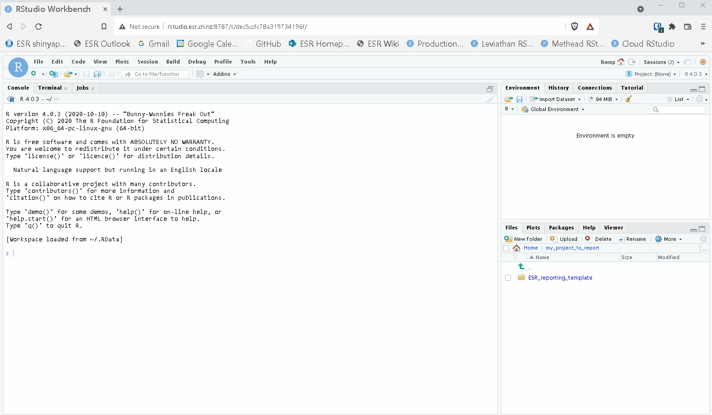
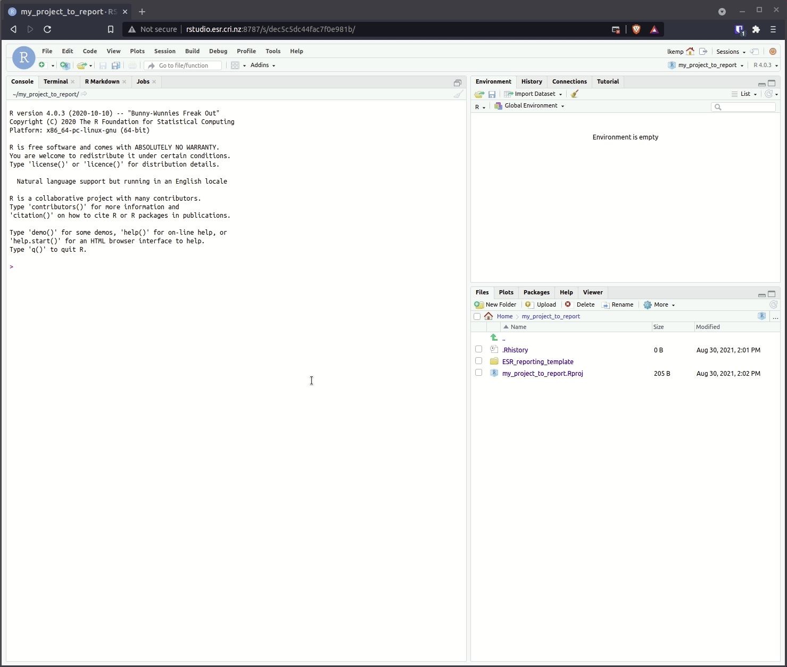

# ESR Reporting Template

This repository contains templating for consistent themed ESR reports/documents using [RMarkdown](https://rmarkdown.rstudio.). Currently, knitting to a html document/report is supported.

Here's a peek at the rendered html report:


- [ESR Reporting Template](#esr-reporting-template)
  - [Assumptions](#assumptions)
  - [How to use](#how-to-use)
    - [Clone this github repository on ESR's production network](#clone-this-github-repository-on-esrs-production-network)
    - [Open the reporting template in an RStudio project](#open-the-reporting-template-in-an-rstudio-project)
    - [Set formatting options in the yaml front matter](#set-formatting-options-in-the-yaml-front-matter)
    - [Include R code and text relevant to your analyses/report](#include-r-code-and-text-relevant-to-your-analysesreport)
    - ["Knit" (render) the document](#knit-render-the-document)
    - [More information](#more-information)

## Assumptions

- You have access to ESR's production network
- Some coding experience (command line and [R](https://www.r-project.org/))

## How to use

### Clone this github repository on ESR's production network

Navigate to your project directory, for example

```bash
cd /home/leah/my_project_to_report/
```

Clone this repository

```bash
git clone https://github.com/ESR-NZ/ESR_reporting_template.git
```

### Open the reporting template in an RStudio project

Navigate to RStudio hosted on ESR's production network at [http://rstudio.esr.cri.nz:8787](http://rstudio.esr.cri.nz:8787), use your regular ESR login credentials to login to RStudio


Create a new RStudio project



Open the reporting RMarkdown (RMD) file, this is the main file for the reporting template



### Set formatting options in the yaml front matter

Some formatting can be configured in the yaml frontmatter of the [reporting_template.RMD file](./reporting_template.RMD)

```yaml
title: "ANALYSIS REPORT"                                # set the main report title
author:
  # - Jane Doe^[Institution Two, jane@example.org]      # add report authors (uncomment if using)
  # - John Doe^[Institution One, john@example.org]      # add a second report author (uncomment if using)
date: "Date: `r format(Sys.time(), '%d/%m/%Y')`"
always_allow_html: true
output:
  bookdown::html_document2:
    toc: true                                           # create a table of contents (true or false)
    toc_depth: 2                                        # set the table of contents depth (number)
    number_sections: false                              # choose whether or not to number sections (true or false)
```

For example, you can set:

- Main report title
- Report authors
- Set the table of contents depth
- Choose whether or not to number report sections

### Include R code and text relevant to your analyses/report

### "Knit" (render) the document


### More information

There is so much more you can do with [RMarkdown](https://rmarkdown.rstudio.), get started with wicked reproducible (and interactive!) documents [here](https://bookdown.org/yihui/rmarkdown/)
